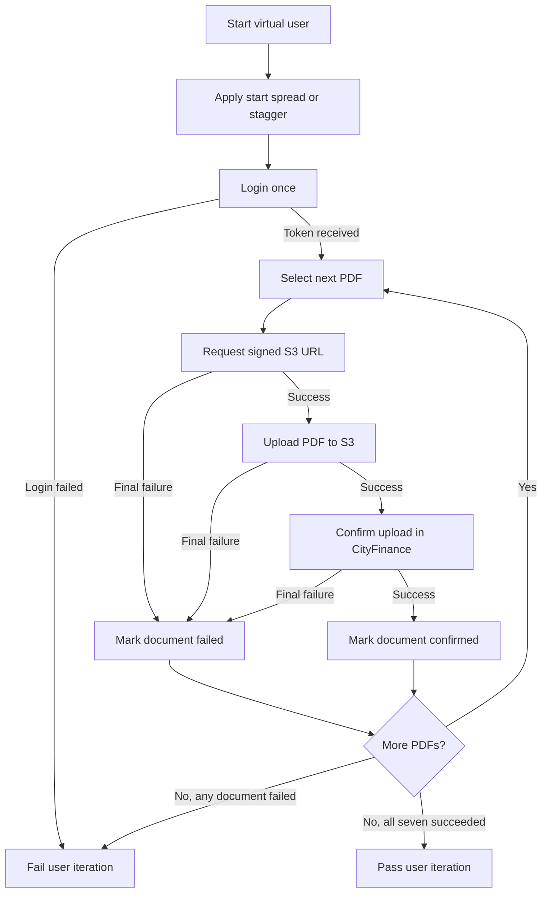

# CityFinance Annual-Account Upload Load Test

This repository contains a [Grafana k6](https://grafana.com/docs/k6/latest/) load test for the CityFinance annual-account document upload workflow. It measures whether multiple concurrent users can log in, obtain signed storage URLs, upload seven PDF documents, and confirm those uploads successfully.

The project supports Windows, macOS, and Linux. Local configuration is loaded securely from an ignored `.env` file through [dotenvx](https://dotenvx.com/).

## Contents

- [What this test does](#what-this-test-does)
- [Test flow](#test-flow)
- [Repository structure](#repository-structure)
- [Prerequisites](#prerequisites)
- [First-time setup](#first-time-setup)
- [Running the test](#running-the-test)
- [Configuration](#configuration)
- [Input documents](#input-documents)
- [Retries](#retries)
- [Metrics and thresholds](#metrics-and-thresholds)
- [Reports](#reports)
- [Interpreting results](#interpreting-results)
- [Troubleshooting](#troubleshooting)
- [Security](#security)

## What this test does

### Non-technical overview

Each virtual user represents one concurrent CityFinance user session. A user logs in once and submits seven annual-account PDF files in sequence. A user is successful only when all seven documents complete the full workflow.

For example:

| Virtual users | Files per user | Total planned files |
| ---: | ---: | ---: |
| 10 | 7 | 70 |
| 50 | 7 | 350 |
| 100 | 7 | 700 |
| 250 | 7 | 1,750 |
| 500 | 7 | 3,500 |

The test answers two different questions:

1. **Functional reliability:** Did every user successfully confirm all seven files?
2. **Performance:** Did request latency and failure rates remain within the configured thresholds?

A run can finish all documents successfully but still fail a latency threshold. The console and HTML report show these outcomes separately.

## Test flow



### Technical API sequence

For each virtual user, the script performs:

1. `POST /api/v2/auth/login`
2. For each of the seven PDFs:
   1. `POST /api/v2/file/signed-url`
   2. `PUT` the PDF binary to the returned signed S3 URL
   3. `POST /api/v2/xvi-fc/annual-account/confirm-upload`
3. Record the user iteration as successful only if all seven confirmations succeed.

The login bearer token is sent only to CityFinance APIs. It is never sent to the signed S3 URL.

## Repository structure

```text
k6-load-testing/
├── .env.example
├── .gitignore
├── cityfinance_ulb_upload_load.js
├── input/
│   ├── 11.pdf
│   ├── 22.pdf
│   ├── 33.pdf
│   ├── 44.pdf
│   ├── 55(1).pdf
│   ├── 66.pdf
│   └── 7.pdf
├── output/
│   └── .gitkeep
├── package.json
├── package-lock.json
└── README.md
```

`input/` contains test data committed with the project. `output/` contains generated reports; report files are ignored by Git.

## Prerequisites

Install the following tools:

- [Grafana k6](https://grafana.com/docs/k6/latest/set-up/install-k6/)
- [Node.js](https://nodejs.org/) with npm

Verify the installations:

```bash
k6 version
node --version
npm --version
```

On Windows PowerShell, if `npm.ps1` is blocked by the execution policy, use `npm.cmd` instead of changing the machine policy:

```powershell
npm.cmd --version
```

## First-time setup

### 1. Install dotenvx

Windows PowerShell:

```powershell
npm.cmd install
```

macOS or Linux:

```bash
npm install
```

### 2. Create the local environment file

Windows PowerShell:

```powershell
Copy-Item .env.example .env
```

macOS or Linux:

```bash
cp .env.example .env
```

Open `.env` and supply valid values for every required variable. Do not commit this file.

### 3. Validate the configuration

Windows PowerShell:

```powershell
npm.cmd run load:inspect
```

macOS or Linux:

```bash
npm run load:inspect
```

This loads `.env` through dotenvx and asks k6 to validate the script without executing the load test.

## Running the test

Run using the values defined in `.env`:

Windows PowerShell:

```powershell
npm.cmd run load:test
```

macOS or Linux:

```bash
npm run load:test
```

### Override the number of users

dotenvx provides the `.env` variables to the k6 process. The k6 `-e` option can override a script variable for a specific run:

```bash
npx dotenvx run -- k6 run -e VUS=50 ./cityfinance_ulb_upload_load.js
```

Common examples:

```bash
# 10 users, 70 planned files
npx dotenvx run -- k6 run -e VUS=10 ./cityfinance_ulb_upload_load.js

# 100 users, 700 planned files
npx dotenvx run -- k6 run -e VUS=100 ./cityfinance_ulb_upload_load.js

# 250 users, 1,750 planned files
npx dotenvx run -- k6 run -e VUS=250 ./cityfinance_ulb_upload_load.js
```

On Windows, use `npx.cmd` if the PowerShell execution policy blocks `npx.ps1`:

```powershell
npx.cmd dotenvx run -- k6 run -e VUS=50 .\cityfinance_ulb_upload_load.js
```

### Run without retries

Use the provided npm script:

```bash
npm run load:test:no-retries
```

Or override the setting directly:

```bash
npx dotenvx run -- k6 run -e VUS=500 -e MAX_RETRIES=0 ./cityfinance_ulb_upload_load.js
```

A no-retry run measures first-attempt reliability. Every transient network error, timeout, rate limit, server error, or confirmation conflict becomes a final failure.

## Configuration

The script reads environment variables through k6's global `__ENV` object. dotenvx loads `.env` into the k6 process; k6 then exposes those values through `__ENV`.

### Required variables

The script stops during initialization if any required variable is missing or blank.

| Variable | Purpose |
| --- | --- |
| `BASE_URL` | CityFinance API base URL |
| `ULB_ID` | Login identifier for the ULB account |
| `PASSWORD` | ULB account password |
| `ULB_OBJECT_ID` | ULB database/object identifier used in storage and confirmation paths |
| `STATE_ID` | State identifier included in confirmation metadata |
| `DESIGN_YEAR_ID` | Design-year identifier used in the S3 path and confirmation payload |
| `DOCUMENT_YEAR_ID` | Document-year identifier included in confirmation metadata |

### Optional variables

| Variable | Default | Purpose |
| --- | ---: | --- |
| `FC_TYPE` | `16thFC` | Finance Commission login type |
| `FY` | `2024-25` | Financial year sent to the confirmation API |
| `SECTION` | `auditedData` | Annual-account storage section |
| `AUDIT_TYPE` | `AUDITED` | Confirmation audit type; allowed values are `AUDITED` and `UNAUDITED` |
| `VUS` | `10` | Number of concurrent virtual users |
| `ITERATIONS_PER_VU` | `1` | Complete seven-file iterations executed by each VU |
| `MAX_RETRIES` | `8` | Maximum additional attempts per retry-enabled operation |
| `RETRY_BASE_SECONDS` | `0.5` | Initial retry backoff in seconds |
| `RETRY_MAX_SECONDS` | `5` | Maximum retry backoff in seconds before jitter |
| `FILE_GAP` | `0` | Wait in seconds after a file completes before starting the next file |
| `MAX_DURATION` | `15m` | Maximum scenario duration |
| `START_SPREAD_SECONDS` | `30` for 100+ VUs; otherwise `0` | Time window across which VU starts are distributed |
| `USER_STAGGER_SECONDS` | Not set | Fixed delay multiplied by the VU position; overrides start spread when provided |
| `SEVENTH_DOCUMENT_TYPE` | `cash-flow` | Supported document type assigned to the seventh physical PDF |

### Start timing

- When `USER_STAGGER_SECONDS` is provided, VU `n` waits `(n - 1) × USER_STAGGER_SECONDS` before login.
- Otherwise, tests with 100 or more VUs distribute starts across 30 seconds by default.
- Tests below 100 VUs start together by default.
- A random delay of up to approximately 0.1 seconds is added when start spread is used.

Example with a fixed 0.1-second stagger:

```bash
npx dotenvx run -- k6 run \
  -e VUS=100 \
  -e USER_STAGGER_SECONDS=0.1 \
  ./cityfinance_ulb_upload_load.js
```

## Input documents

The active test reads these seven PDFs during k6 initialization:

| File | CityFinance document type |
| --- | --- |
| `input/11.pdf` | `receipts-and-payments-statement` |
| `input/22.pdf` | `balance-sheet` |
| `input/33.pdf` | `balance-sheet-schedules` |
| `input/44.pdf` | `income-expenditure` |
| `input/55(1).pdf` | `income-statement-schedules` |
| `input/66.pdf` | `cash-flow` |
| `input/7.pdf` | `cash-flow` by default, configurable with `SEVENTH_DOCUMENT_TYPE` |

Keep these filenames and paths unchanged unless the `DOCUMENTS` configuration in the script is updated at the same time.

## Retries

Retries do not restart the whole user flow or repeat all seven files. They repeat only the failed operation for the current document.

| Operation | Retried? | Retry action |
| --- | --- | --- |
| Login | No | The user iteration stops if login fails |
| Signed URL | Yes | Repeats the signed-URL API using the same upload ID and payload |
| S3 upload | Yes | Repeats the same PDF `PUT` using the same signed URL |
| Confirm upload | Yes | Repeats only confirmation using the same upload ID, S3 key, and metadata |

Retryable outcomes are:

- Network status `0`, including connection resets and EOF errors
- HTTP `408` request timeout
- HTTP `409` conflict
- HTTP `429` rate limit
- HTTP `5xx` server errors

With `MAX_RETRIES=8`, an operation can execute once initially and then up to eight additional times, for a maximum of nine attempts.

Retry waits use capped exponential backoff with random jitter. With the defaults, delays start near 0.5 seconds, increase toward 5 seconds, and vary by approximately ±25% so concurrent users do not retry simultaneously.

## Metrics and thresholds

### Functional metrics

| Metric | Meaning |
| --- | --- |
| `login_failed` | Final login failure rate |
| `signed_url_failed` | Final signed-URL failure rate after retries |
| `storage_upload_failed` | Final S3 upload failure rate after retries |
| `confirm_upload_failed` | Final confirmation failure rate after retries |
| `iteration_success` | Percentage of users whose complete seven-file flow succeeded |
| `documents_uploaded` | Number of documents successfully confirmed |
| `storage_retry_attempts` | Additional S3 attempts performed |
| `confirm_retry_attempts` | Additional confirmation attempts performed |

### Latency metrics

The script records separate timing trends for:

- Login
- Signed-URL generation
- S3 upload
- Confirmation
- All HTTP requests through k6's built-in metrics

### Configured thresholds

| Metric | Requirement |
| --- | --- |
| Overall HTTP request failures | Less than 5% |
| Final login failures | Less than 5% |
| Final signed-URL failures | Less than 5% |
| Final S3 failures | Less than 5% |
| Final confirmation failures | Less than 5% |
| Successful user iterations | Exactly 100% |
| Login p95 | Less than 3 seconds |
| Confirmation p95 | Less than 5 seconds |

k6 returns a non-zero exit code when any threshold fails.

## Reports

Every completed run writes the following files under `output/`:

```text
output/
├── report.html
├── summary.json
├── cityfinance-upload-{VUS}-users-{timestamp}.html
└── cityfinance-upload-{VUS}-users-{timestamp}.json
```

- `report.html` and `summary.json` contain the latest run and are overwritten each time.
- Timestamped files preserve individual run results locally.
- Generated report files are ignored by Git.
- `output/.gitkeep` keeps the directory available after cloning.

The HTML report includes workload totals, confirmed and failed documents, user success, request latency, and threshold results. The JSON report contains the complete k6 summary data for further analysis.

## Interpreting results

### Functional pass

A functional pass requires:

- Every planned document to be confirmed.
- Every user iteration to complete all seven documents successfully.

### Threshold pass

A threshold pass requires all configured failure-rate and latency conditions to pass.

These results should be reported separately. For example, all documents may eventually succeed through retries while raw HTTP attempts or login latency still exceed a performance threshold.

### First-attempt versus eventual reliability

- Use the normal retry configuration to measure eventual user-facing reliability.
- Use `MAX_RETRIES=0` to measure raw first-attempt reliability.
- A high retry count is evidence of instability even when the final functional result passes.

## Troubleshooting

### Required environment variable is missing

Example:

```text
PASSWORD is required. Load it from .env before running k6.
```

Confirm that `.env` exists, contains a non-empty value, and that the command is run through dotenvx:

```bash
npx dotenvx run -- k6 inspect --include-system-env-vars ./cityfinance_ulb_upload_load.js
```

### PowerShell blocks npm or npx

Use the Windows command shims:

```powershell
npm.cmd run load:test
npx.cmd dotenvx run -- k6 run -e VUS=50 .\cityfinance_ulb_upload_load.js
```

### `File not found` during k6 initialization

Verify that all seven active PDFs exist under `input/` with the exact expected filenames.

### Confirmation returns `File not found in S3`

The confirmation API validates that the supplied S3 key exists. A dummy key cannot replace the signed-URL and S3 upload steps when testing the real API.

### HTTP `409 Resource already exists`

Concurrent requests using the same ULB and document category can temporarily conflict. The normal configuration retries HTTP 409 responses with backoff. A no-retry run records the conflict as a final document failure.

### S3 EOF, timeout, or closed connection

These are treated as transient status-0 failures and retried when `MAX_RETRIES` is greater than zero. Review the retry count and S3 latency even if all files eventually succeed.

### Output files are missing

Confirm that the `output/` directory exists and that the process can write to it. The committed `.gitkeep` normally ensures the directory is available after cloning.

## Security

- Never commit `.env` or real credentials.
- Keep only placeholders in `.env.example` and documentation.
- Prefer CI/CD secret stores for automated and production-like runs.
- Avoid placing passwords directly on the command line because shell history may retain them.
- Review variables carefully before using `--include-system-env-vars` with k6 Cloud or archive operations.
- The signed S3 request intentionally excludes the CityFinance bearer token.

To verify local secrets and reports are ignored:

```bash
git check-ignore -v .env
git check-ignore -v output/report.html
```

For CI/CD, configure the required variable names in the platform's secret manager and inject them into the k6 process. Do not create or commit a production `.env` file.
